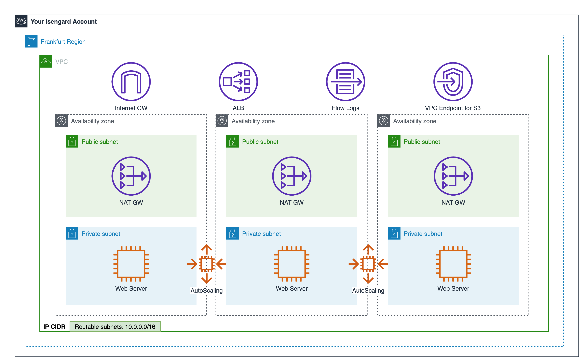

# Welcome to your CDK Hackathon TypeScript project!

## Target Architecture to be built

## Hackathon instructions:
- Please search for `TODO:` in the code repo to complete the missing implementation
- To track your progress, please run `npm run test` You will see the test results
- Please search for `TODO:` in all files and follow the instructions

## CDK Prerequisites:
- brew install node
- brew install npm
- npm install -g aws-cdk

The `cdk.json` file tells the CDK Toolkit how to execute your app.

## Useful commands

 * `npm run build`   compile typescript to js
 * `npm run watch`   watch for changes and compile
 * `npm run test`    perform the jest unit tests
 * `cdk deploy`      deploy this stack to your default AWS account/region
 * `cdk diff`        compare deployed stack with current state
 * `cdk synth`       emits the synthesized CloudFormation template

## Hint: Required infrastructure is automatically tested, top score is 26

